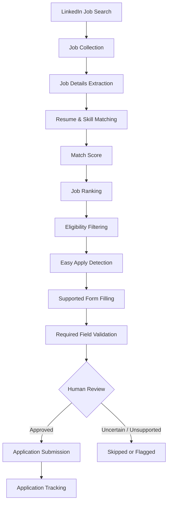

<div align="center">

# 🤖 AI Job Automation

### Find better-fit jobs faster: search, score, rank, and apply, with you in control of every final decision.

A Python-based personal job-search assistant that discovers LinkedIn jobs, matches them against your resume, highlights skill gaps, ranks the best fits, and streamlines supported **Easy Apply** applications, pausing for your review whenever it's unsure.


[Quick Start](#-quick-start) · [How It Works](#-how-it-works) · [Configuration](#-configuration) · [Safety](#-safety--responsible-use) · [Roadmap](#-roadmap)

</div>

---

## 📑 Table of Contents

- [Why This Project](#-why-this-project)
- [Key Features](#-key-features)
- [How It Works](#-how-it-works)
- [Tech Stack](#-tech-stack)
- [Project Structure](#-project-structure)
- [Quick Start](#-quick-start)
- [Configuration](#-configuration)
- [Usage](#-usage)
- [How Matching Works](#-how-matching-works)
- [Output & Tracking](#-output--tracking)
- [Design Principles](#-design-principles)
- [Safety & Responsible Use](#-safety--responsible-use)
- [Troubleshooting](#-troubleshooting)
- [FAQ](#-faq)
- [Known Limitations](#-known-limitations)
- [Roadmap](#-roadmap)
- [Contributing](#-contributing)
- [Author](#-author)
- [License](#-license)

---

## 💡 Why This Project

Applying for software jobs manually is repetitive: run a search, open dozens of tabs, read every description, compare it to your resume, then fill near-identical forms again and again.

**AI Job Automation** removes that repetition while keeping *you* in charge of anything uncertain or high-stakes. It does the reading, comparing, and form-filling grunt work, and you make the decisions.

> **Goal:** spend your time on the applications that matter, not on copy-pasting the same answers into forms.

### At a glance

| Without this tool | With this tool |
|---|---|
| Manually scan dozens of listings | Listings collected automatically from your search settings |
| Guess which jobs fit your resume | Every job gets a transparent match score |
| Discover skill gaps mid-interview | Missing skills listed per job up front |
| Retype the same form answers | Recognised fields filled automatically |
| Lose track of where you applied | Every submission logged to CSV |

---

## ✨ Key Features

| Feature | Description |
|---|---|
| 🔍 **Automated Job Search** | Searches LinkedIn using configurable keywords, locations, and filters |
| 📋 **Job Data Collection** | Collects title, company, location, link, and full description via Playwright + CDP |
| 📄 **Resume Parsing** | Extracts skills, experience, and projects from a text-based PDF resume |
| 🧮 **Match Scoring** | Rule-based, explainable scoring of each job against your resume |
| 🕳️ **Skill Gap Detection** | Flags skills required by a job that are missing from your resume |
| 🏆 **Job Ranking** | Sorts opportunities by match score and eligibility |
| ✅ **Eligibility Filtering** | Drops jobs that don't meet your experience or location constraints |
| ⚡ **Easy Apply Detection** | Identifies listings that support LinkedIn Easy Apply |
| 📝 **Supported Form Filling** | Auto-fills fields the tool recognises |
| 🛡️ **Field Validation** | Checks required fields before allowing submission |
| 👀 **Human-in-the-loop Review** | Pauses on uncertain or unsupported fields for your input |
| 📊 **Application Tracking** | Logs every submission to CSV for follow-up |

---

## 🔄 How It Works



**In short:** the pipeline has two halves.

1. **Discovery & analysis** (search → collect → extract → score → rank → filter): fully automated and read-only.
2. **Application** (detect → fill → validate → review → submit → track): automated only for fields it recognises, and it stops for you at anything else.

---

## 🧱 Tech Stack

| Area | Technology |
|---|---|
| Language | Python 3.10+ |
| Browser automation | Playwright + Chrome DevTools Protocol (CDP) |
| Resume parsing | PDF text extraction |
| Data storage | CSV-based pipelines |
| Matching engine | Rule-based resume/job comparison |

---

## 📂 Project Structure

```text
ai-job-automation/
├── scraper/        # LinkedIn search & job collection (Playwright/CDP)
├── extractor/      # Job description parsing
├── resume/         # Resume PDF parsing & data extraction
├── matcher/        # Match scoring & skill gap detection
├── ranker/         # Job ranking & eligibility filtering
├── apply/          # Easy Apply detection & form filling
├── tracker/        # Application tracking (CSV logs)
├── config/         # Search keywords, filters, personal settings (gitignored)
├── main.py         # Entry point
├── requirements.txt
└── README.md
```

Each stage lives in its own module, so you can tune or replace one (for example, the matcher) without touching the rest.

---

## ⚡ Quick Start

**Prerequisites:** Python 3.10+, Google Chrome, and a LinkedIn account.

```bash
# 1. Clone
git clone https://github.com/gbhanuprasad5261/ai-job-automation.git
cd ai-job-automation

# 2. Create a virtual environment (recommended)
python -m venv .venv
source .venv/bin/activate        # Windows: .venv\Scripts\activate

# 3. Install dependencies
pip install -r requirements.txt
playwright install chromium

# 4. Start Chrome with remote debugging (see Configuration), log in to LinkedIn, then:
python main.py
```

---

## 🔧 Configuration

### 1. Add your resume

Place your resume PDF where the `resume/` module expects it. Use a **text-based PDF**; scanned image PDFs need OCR first.

### 2. Set search preferences

Edit the files in `config/` to set your keywords, locations, and filters. The exact file names and keys depend on your version of the project; the values below show the kind of settings you'll control:

| Setting | Example | Purpose |
|---|---|---|
| Keywords | `Java Developer`, `Backend Engineer` | What to search for |
| Location | `Bengaluru`, `Remote` | Where to search |
| Experience level | `Entry level` | Eligibility filtering |
| Minimum match score | your chosen threshold | Skip low-fit jobs |
| Easy Apply only | `true` / `false` | Restrict to supported applications |

### 3. Launch Chrome with remote debugging

The tool attaches to your own logged-in browser session, so it never needs your password.

```bash
# macOS
/Applications/Google\ Chrome.app/Contents/MacOS/Google\ Chrome --remote-debugging-port=9222

# Linux
google-chrome --remote-debugging-port=9222

# Windows
"C:\Program Files\Google\Chrome\Application\chrome.exe" --remote-debugging-port=9222
```

### 4. Log in to LinkedIn

Log in manually in that Chrome window, then run the tool.

### 5. Protect your private files

Add personal files to `.gitignore` so they never reach GitHub:

```gitignore
config/
*.pdf
*.csv
.venv/
__pycache__/
```

---

## ▶️ Usage

```bash
python main.py
```

A typical run:

1. **Search:** queries LinkedIn using your configured keywords and filters
2. **Collect:** gathers listings and extracts full job descriptions
3. **Score & rank:** compares each job against your resume and orders the results
4. **Review gaps:** shows the skills each shortlisted role wants that your resume lacks
5. **Apply (Easy Apply only):** fills supported fields, then **pauses for your review** before submitting
6. **Track:** logs every submitted application to CSV

> 💡 **Tip:** start with a small search and a high match threshold on your first runs so you can check the behaviour before scaling up.

---

## 🧮 How Matching Works

Matching is currently **rule-based**, so results are transparent and easy to tune.

```text
Resume ──► skills, tools, keywords ─┐
                                     ├─► compare ─► weighted score ─► ranked list
Job    ──► required + preferred  ───┘                 + missing skills
```

1. **Extract** skills, tools, and keywords from your resume
2. **Extract** required and preferred skills from each job description
3. **Compare** the two sets, weighting *required* skills more heavily than *preferred* ones
4. **Score** each job and list the missing skills as your skill gap
5. **Filter & rank** by score and your eligibility constraints (experience level, location, etc.)

**Reading the results:**

- A high score with few gaps → strong candidate to apply to
- A moderate score with gaps you can close quickly → worth a tailored look
- A low score → likely skipped

Because matching is keyword-driven, unusual phrasing in a job description (or a resume that uses different wording for the same skill) can shift scores. **Treat the score as a guide, not a verdict.**

---

## 📊 Output & Tracking

Results are stored as CSV files, so they open easily in Excel, Google Sheets, or pandas.

| File | Contents |
|---|---|
| **Collected jobs** | Title, company, location, description, link |
| **Ranked jobs** | Match score, matched skills, missing skills, Easy Apply flag |
| **Applications log** | What was submitted, when, and for which role |

Quick analysis with pandas:

```python
import pandas as pd

ranked = pd.read_csv("ranked_jobs.csv")   # adjust to your output path
print(ranked.sort_values("match_score", ascending=False).head(10))
```

> Column names above are illustrative; check your generated CSV headers.

---

## 🧭 Design Principles

- **Human in the loop.** The tool asks rather than guesses on unknown, uncertain, or high-stakes fields.
- **Transparent over clever.** Rule-based scoring means you can see *why* a job scored the way it did.
- **Your session, your data.** No credentials are stored; personal files stay local.
- **Modular pipeline.** Each stage is a separate module that can be improved independently.
- **Personal scale.** Built for an individual job seeker, not bulk or commercial use.

---

## 🔐 Safety & Responsible Use

- **Human in the loop:** the tool pauses on unknown, uncertain, or high-stakes fields instead of guessing.
- **No stored credentials:** it reuses your own logged-in browser session via CDP.
- **Personal use only:** built for individual job seekers, not bulk or commercial scraping.
- **Keep private data private:** never commit your resume, config, or application logs.
- **Review before you submit:** check every application yourself, especially answers about work authorisation, salary, and notice period.

### ⚠️ Disclaimer

Automating interactions with LinkedIn may conflict with LinkedIn's Terms of Service, and accounts that use automation can be restricted. Use this tool sparingly, review every application before it is submitted, and use it at your own risk. The author is not responsible for account restrictions or incorrect applications.

---

## 🛠️ Troubleshooting

| Problem | Likely fix |
|---|---|
| Can't connect to Chrome | Make sure Chrome was started with `--remote-debugging-port=9222` and no other Chrome instance is blocking the port |
| Not logged in to LinkedIn | Log in manually in the debug Chrome window, then re-run |
| Resume text looks empty | Use a text-based PDF; scanned image PDFs need OCR first |
| Form fields not filled | The field type may not be supported yet; complete it manually when the tool pauses |
| `playwright` errors | Re-run `playwright install chromium` |
| Scores look off | Check that your resume uses the same skill names as job postings (e.g. "Spring Boot", not just "Spring") |
| Very few jobs collected | Broaden keywords, or relax the eligibility filters |

---

## ❓ FAQ

**Does it need my LinkedIn password?**
No. It attaches to a Chrome window you've already logged in to.

**Will it submit applications without asking?**
It fills only the fields it recognises and pauses for your review on anything uncertain or unsupported.

**Does it work with jobs that aren't Easy Apply?**
It can still collect, score, and rank them, but application submission targets Easy Apply listings.

**Is the matching AI-powered?**
Currently it's rule-based. LLM-based matching is on the [roadmap](#-roadmap).

**Can I use it for other job boards?**
Not yet; LinkedIn is the only supported source at the moment.

---

## 🚧 Known Limitations

- Matching is keyword-based, so synonyms and unusual phrasing can affect scores
- Only LinkedIn Easy Apply flows are supported for submission
- Custom or unusual form questions are handed back to you
- LinkedIn page changes can break selectors and may require updates
- Scanned (image-only) resumes are not parsed without OCR

---

## 🛣️ Roadmap

**Near term**
- [ ] Automated tests and CI
- [ ] Clearer sample config and `.env.example`
- [ ] Notification system for new high-match postings

**Mid term**
- [ ] LLM-based resume-to-job matching (beyond rule-based scoring)
- [ ] Cover letter auto-drafting per job
- [ ] Web dashboard for reviewing ranked jobs and tracking applications

**Long term**
- [ ] Support for additional job boards beyond LinkedIn
- [ ] Resume tailoring suggestions based on detected skill gaps

---

## 🤝 Contributing

Suggestions, bug reports, and pull requests are welcome.

1. Fork the repository
2. Create a feature branch: `git checkout -b feature/your-feature`
3. Commit your changes: `git commit -m "Add your feature"`
4. Push the branch: `git push origin feature/your-feature`
5. Open a pull request describing what changed and why

Please keep changes focused, avoid committing personal data, and preserve the human-in-the-loop behaviour.

---

## 👤 Author

**G Bhanu Prasad**
📧 [gbhanuprasad1236@gmail.com](mailto:gbhanuprasad1236@gmail.com)
🔗 [LinkedIn](https://linkedin.com/in/g-bhanu-prasad-66ab1b225) · [GitHub](https://github.com/gbhanuprasad5261)

---

## 📄 License

This project is licensed under the MIT License.

<div align="center">

⭐ If this project helps your job search, consider giving it a star.

</div>
